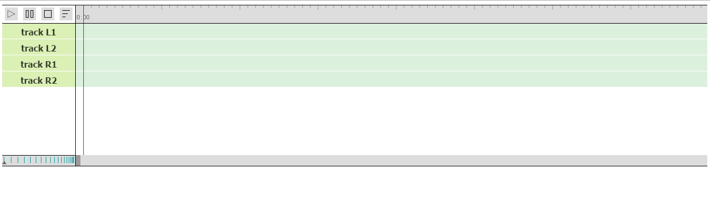

# DDMUG
html5 music game

A music game project designed to help players promote their personal gamimg experience

##features
 - a pure html5&javascript project
 - simple & easy to user or modify
 - contains with a powerful editor ( make it easy to build your own music map )

##setup player
1.import js files. since I do not composite these into one file 
```html
<script type="text/javascript" src="game.js"></script>
<script type="text/javascript" src="stats.min.js"></script>
<script type="text/javascript" src="Loader.js"></script>
```
2.add a placeholder div in your html file.
```html
<div id="content">

</div>
```
3.build stage. Here is an example for you, and you can see this Code fragment in test.html
```javascript
//DDMUG
var stage = new DDMUG.Stage({width: window.innerHeight>window.innerWidth?window.innerWidth-5:600, height: window.innerHeight-5});
document.querySelector('#content').appendChild( stage.domElement );

var loader = new DD.Loader(true);//load music map with DD.Loader
document.querySelector('#content').appendChild(loader.statusDomElement);

loader.load(mapUrl, function(mapdata){
	stage.init(musicUrl, mapdata);
	
	stage.audio.addEventListener("ended", function(e) {
		//... 
	});
});

document.querySelector('#start').onclick = function(){
	if(stage.initialized){
		//...
		stage.play();
	}
	return false;
};
```
##setup editor
since editor uses AudioContext to decode/analysis music, you can only run editor with recent bowers like Chrome/Firefox/Edge, ie <= 11 not supported.<br>
1.import js files.
```javascript
<script src="editor.js"></script>
<script src="analyzer.js"></script>
```
2.build stage.
```javascript
var stage = new DDMUG.Edioter({width: window.innerWidth-20});
document.body.appendChild( stage.domElement );
stage.init(musicUrl);
```
##use editor
为了方便的创造出music map, 特别提供了本editor。
首先简单介绍下editor的功能和使用方式。

* 
界面布局：

 * 左上方四个按钮，分别是播放、暂停、停止、导出 按钮。
 * 右侧是时间轴。
 * 中部是4个轨道，从上到下分别对应D、F、J、K 四个轨道，在这里设置什么时间、哪个轨道上要出现一个music node。
 * 左下方是时间缩放的滑块，控制时间轴的缩放比例。
 * 最下面是滚动条。
 

*  
基本功能：

 * 播放/暂停：通过点击相应按钮，或者空格键控制。
 * 打点: 在相应的轨道上双击增加记录点，在记录点上双击取消该记录点。或者通过键盘上相应的按键(D/F/J/K)在轨道上增加或删除记录点。
 * 预览: 按住ctrl键盘同时拖动红色的时间线，可以预览当前时间的声音。同AE上一样的功能。
 * 导出: 按导出按钮可以导出绘制好的map，同时在console中也会打印出当前map的内容。
 
 
*  
控制台功能：
 * ```stage.pannel.importMusicMap(musicMapString)``` 导入map，需要传入map的内容。
 * ```stage.pannel.setBPM(bpm)``` 设置音乐的BPM，这个会影响时间轴上1s内有多少个刻度，只有在精确的刻度上才能打点。
 * ```stage.pannel.analysis(url)``` 自动生成map，需要传入音乐的url。如果对生成的map不满意，可以手工调整，或者参考analysis.js调整其中的参数。在调用此方法前，应当先正确的设置歌曲的BPM。


now you have your environment ready, you can also check the home link of this project and see how I was using.
